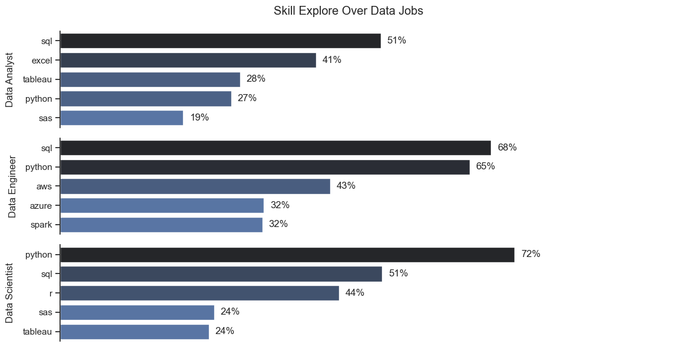
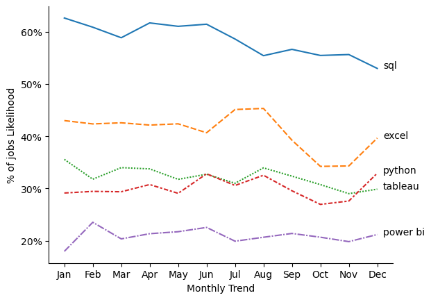
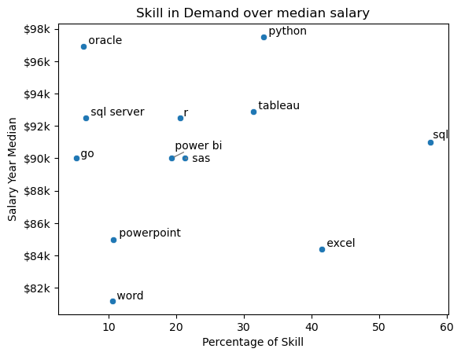

# Data Analysis Report: 2023 Job Vacancy Trends
### Introduction
The dataset analyzed contains information about job vacancies from 2023, sourced from various platforms and countries. The dataset includes key attributes like job title, company, location, salary, and platform. The primary goal is to understand job market trends, identify in-demand job roles, and determine the platforms most preferred for job postings.

# The Questions

Below are the questions I want to answer in my project:

1. What are the skills most in demand for the top 3 most popular data roles?
2. How are in-demand skills trending for Data Analysts?
3. How well do jobs and skills pay for Data Analysts?
4. What are the optimal skills for data analysts to learn? (High Demand AND High Paying) 


# Tools I Used

- **Python:** The backbone of my analysis, allowing me to analyze the data and find critical insights.I also used the following Python libraries:
    - **Pandas Library:** This was used to analyze the data. 
    - **Matplotlib Library:** I visualized the data.
    - **Seaborn Library:** Helped me create more advanced visuals. 
- **Jupyter Notebooks:** The tool I used to run my Python scripts which let me easily include my notes and analysis.
- **Visual Studio Code:** My go-to for executing my Python scripts.
- **Git & GitHub:** Essential for version control and sharing my Python code and analysis, ensuring collaboration and project tracking.

## Import & Clean Up Data

I start by importing necessary libraries and loading the dataset, followed by initial data cleaning tasks to ensure data quality.

```python
# Importing Libraries
import ast
import pandas as pd
import seaborn as sns
from datasets import load_dataset
import matplotlib.pyplot as plt  

# Loading Data
dataset = load_dataset('lukebarousse/data_jobs')
df = dataset['train'].to_pandas()

# Data Cleanup
df['job_posted_date'] = pd.to_datetime(df['job_posted_date'])
df['job_skills'] = df['job_skills'].apply(lambda x: ast.literal_eval(x) if pd.notna(x) else x)
```

## Filter US Jobs

To focus my analysis on the U.S. job market, I apply filters to the dataset, narrowing down to roles based in the United States.

```python
df_usa = df[(df['job_country'] == 'United States') & (df['job_title'] == 'Data Analyst')].copy()
```

in case to change filter to other roles, you can change the job_title to the role you want to analyze.

## Analysis Highlights
**1. Most Demanded Skills for Top 3 Data Roles**

* Data Analyst: SQL, Excel, Tableau, Python, Power BI.
* Data Scientist: Python, SQL, Machine Learning, Statistics, R.
* Data Engineer: Python, SQL, AWS, Spark, Azure.

**Key Insight:**  Python and SQL are consistently critical across all roles, with a stronger emphasis on specialized tools like AWS for Data Engineers.

### Results



**2. In-Demand Skills Trends for Data Analysts**

* SQL and Excel remain foundational and widely required skills in data analytics, with SQL maintaining the top spot despite its declining trend.
* Python and Tableau are steady contenders, emphasizing their critical role in analytics workflows.
* Power BI is an emerging tool with increasing relevance toward the year's end, signaling a shift in demand for data visualization skills.

### Results



**3. Highest Paid & Most Demanded Skills for Data Analysts**

* Highest Paid Skills: Advanced tools like dplyr, Bitbucket, Gitlab (up to $200K).
* Most In-Demand Skills: Foundational skills like SQL, Excel, PowerPoint, Tableau.

**Key Insight:** High-paying skills tend to be specialized, while foundational skills drive employability.



**4. Optimal Skills to Learn for Data Analysts**

* Foundational Skills: SQL, Excel, Power BI, Tableau.
* Technical Skills: Python, R, dplyr, Git, Bitbucket.
* Cloud/Big Data: AWS, Azure, Spark for advanced career paths.

**Key Strategy:** Blend foundational skills for employability with specialized skills for higher salary potential.

# General Insights from the Data Job Market Analysis
## Skill Demand and Salary Correlation

Skills like Python, Oracle, and AWS are associated with higher salaries, reflecting their advanced and specialized nature.

Foundational skills (e.g., SQL, Excel) are essential for entry-level positions but may not lead to the highest pay without complementary expertise.

## Market Trends

The demand for skills evolves throughout the year, emphasizing the need for continuous learning.

Skills like Excel saw a resurgence in popularity, while foundational tools like SQL showed steady demand. Emerging tools (e.g., Power BI) are gaining traction.

## Economic Value of Skills

Specialized skills (e.g., cloud technologies, big data tools) offer high economic returns.
A balanced skill set of both high-demand and high-paying skills is critical for maximizing career potential.

## Key Takeaway
Staying updated on market trends and prioritizing skill development in both foundational and advanced technologies can significantly enhance employability and earning potential.

# Conclusion

This analysis of the data analyst job market has shed light on the key skills and trends shaping the field in 2023. Here’s what it emphasized:

for more detailed view on project :

**1. [Exploring DA](Project1\EDA_intro.ipynb)**

**2. [Skills_Trend](Project1\Skills_trend.ipynb)**

**3. [Optimal Skills](Project1\OptimalSkill.ipynb)**


## Critical Skills: 
Foundational skills like SQL and Excel are vital for employability, while advanced tools like Python and AWS offer pathways to higher salaries and specialized roles.
## Market Trends:
Skill demand is dynamic, with notable shifts in the prominence of tools like Excel and Power BI, underscoring the need to stay agile in career development.

## Career Guidance:
 Insights from this project provide a roadmap for skill prioritization and targeted learning, empowering data professionals to make informed decisions.
